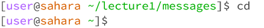
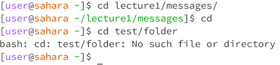
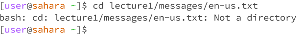
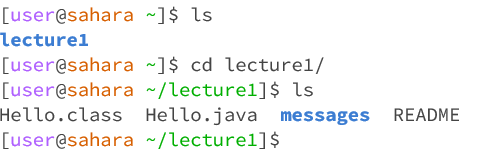
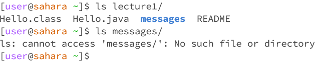
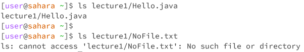
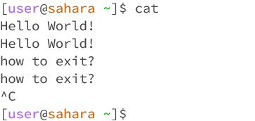
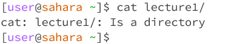
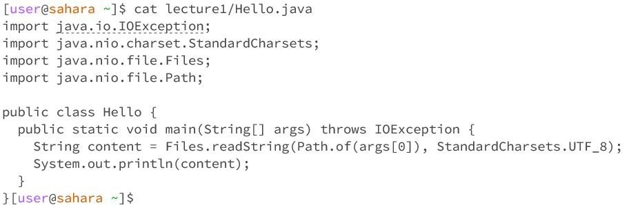

# cd
cd or change directory just allows us to move through the file system on our device. 
## no arguments
With no arguments we will be returned to our user directory, for both Linux and Windows.

## directory as an argument
We will get moved to the path what we have provided, or we will just recive an error that there is no such directory.

## file as an argument
We will just recive an error message that our path is not a directory.

# ls
ls or list, simple tool to see containment oif directories in order to navigate in a file system.
## no arguments
Command will show all the containments of our current directory, with colorcoding the directories and executable files and ect.

## directory as an argument
Will do exactly the same operation as with no arguments, but in the specified directory, without changing ours directory.

## file as an argument
It will just give us back a path to that file if it exist, or throw an exception if path is not real.

# cat
cat or concatenate simply shows the containment of specified files.
## no arguments
Cat will continue running and listening for input into the shell, and after pressing ENTER key it will just return back whatever we typed in. Ctrl+C to exit.

## directory as an argument
It will just throw an error that it's a directory.

## file as an argument
It will show the containment of the file, as well as we can continue to adding paths to multiple files and see all of them at once.

