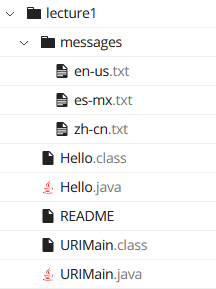
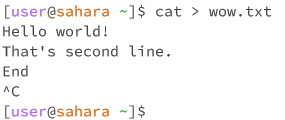
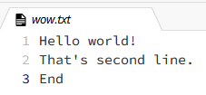

For all examples below we are going to work with *lecture1* directory, which has a stracture as shown below.

---

# cd
- cd or change directory just allows us to move through the file system on our device. 
## no arguments
- With no arguments we will be returned to our work directory, in that case it's */home*.
  

## directory as an argument
- We will get moved to the path what we have provided, or we will just recive an error that there is no such directory. Since it's impossible to open a directory which doesn't exist. In that case we changed our directory from home directory (*/home*) to */home/lecture1/messages*.
  

## file as an argument
- We will just recive an error message that our path is not a directory. You cannot change a directory if what you are trying to change to is not a directory.
  

---

# ls
- ls or list, simple tool to see containment oif directories in order to navigate in a file system.
## no arguments
- Command will show all the containments of our current directory, with colorcoding the directories and executable files and ect.
  

## directory as an argument
- Will do exactly the same operation as with no arguments, but in the specified directory which we specified as an argument, without changing our current directory. In case if the path what we are trying to acces does not exist we will recive an error message. 
  

## file as an argument
- It will just give us back a path to that file if it exist, or throw an error message if path is not real. So it can be used as a tool to check if the file exist in a specified path.   

---

# cat
- cat or concatenate simply shows the containment of specified files.
## no arguments
- Cat will continue running and listening for input into the shell, and after pressing ENTER key it will just return back whatever we typed in. Ctrl+C to exit. It's not an error, and we actually can use it in order to write down information to files. 
    

  

## directory as an argument
- It will just throw an error that it's a directory, because it asks specifically for a file.
  

## file as an argument
- It will show the containment of the file, as well as we can continue to adding paths to multiple files and see all of them at once.
  

